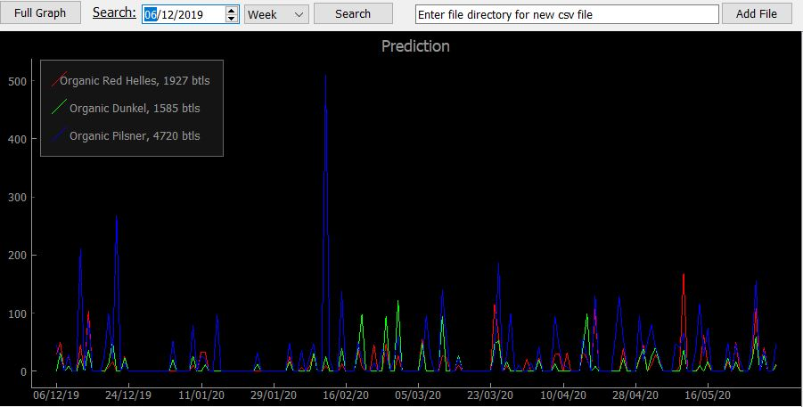
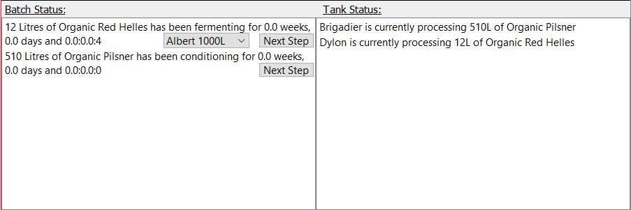
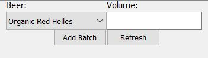
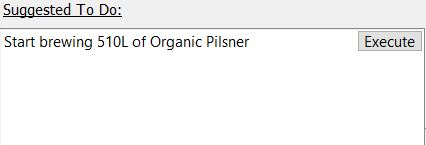
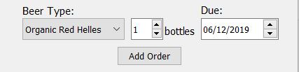
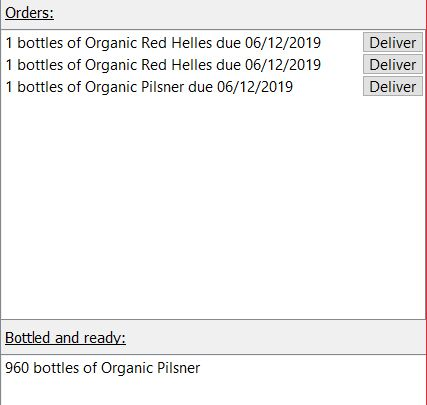

# Beer Management

Beer Management is a Python script for providing a user interface for
Barnaby's Brewhouse to manage the sale and organisation of beers.

## Framework
User interface built using [PyQt5](https://github.com/PyQt5)

## Features
* Graph of prediction up to a year in the future
* Ability to search through prediction
* Interface to manage batches
* Suggestions on what needs to be done
* Interface to manage orders and inventory


## Installation

Python needs to be installed on the system. This can be done through the
official python website by downloading the installer and running it.

Check python is correctly installed by running the following command.

```bash
python --help
```

## Usage
To open the user interface, locate to the folder user_interface.py is located in the commandline.

Then execute the following:
```bash
python user_interface.py
```

Graph:


* The graph is a prediction obtained by multiplying the last sales data provided
for each beer provided with the daily growth rates for every day.

* To search for a specific week or a month, enter the starting date for 
that period, choose week or month from the drop down menu.

* The full graph can be shown again by pressing the "Full Graph" button.

* To add a csv file with new data, type in the full directory for the file 
and press the "Add File" button. If successful, a message should appear
saying "success".

Batch Status and Tank Status:


* The Batch Status shows all batches currently being produced.

* To move a batch to the next stage in production, click on the "Next Step"
button next to it. If a tank is required for the next stage, a drop down
menu will appear to choose the tank from.

* The Tank Status shows any tanks that is currently processing a batch.

Adding a new batch and refreshing the page:


* To add a new batch manually, choose the beer type from the drop down menu,
enter the volume in integers and press the "Add Batch" button. Only batches 
of up to 1000L can be entered as there is no tank that can handle more than
1000L.

* The refresh button updates all the information being shown in the interface
such as the time each batch has been processing.

Suggest To Do:


* This is a list of actions that are suggested. There are two types of 
suggestions that will be made. One to suggest to start brewing and one to
suggest to move a batch to the next stage.

* Starting a batch will be suggested by looking at the beer with the highest
demand ten weeks into the future and the available facilities. Pressing the 
"Execute" button next to the suggestion will add the batch with the 
suggested volume automatically.

* Moving a batch to the next stage will be suggested if the batch has been
processing in that stage for longer than the maximum time for that stage. 
A button to do this automatically will appear if the next stage does not
require a tank.

Adding an order:


* To add a new order, choose the type of beer, number of bottles ordered
and the due date for the order, then press the "Add Order" button.

* The maximum number of bottles that can be ordered is 1000.

"Orders" and "Bottled and ready":


* The "Orders" section shows all the orders that have not yet been 
delivered.

* The "Deliver" button will remove the corresponding number of bottles from 
the inventory.

* The "Bottled and ready" section shows each type of beer and how many bottles
bottles of it are ready to be delivered.

## Log file
Logs of what happened is recorded in a file called log_file.log.
